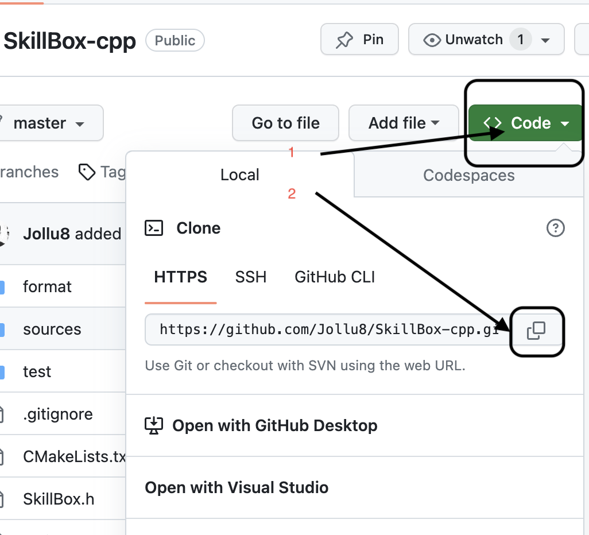
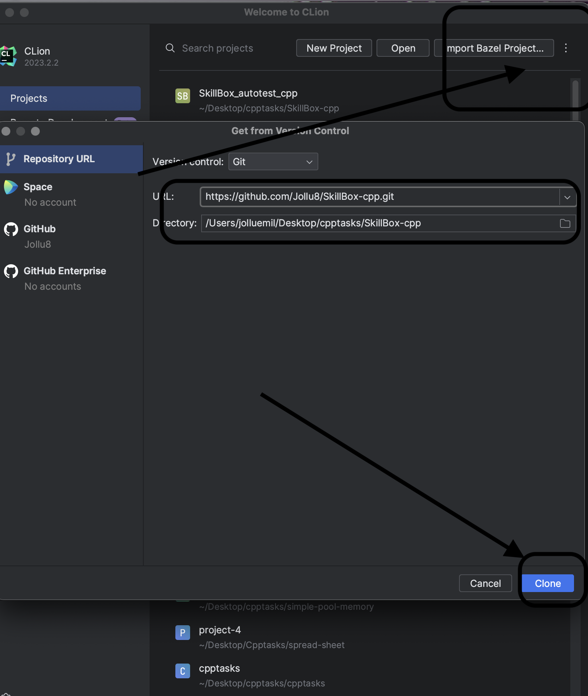

# Тесты для SkillBox C++

- ## Required:

Linux:
- `sudo apt install build-essential`
- idea рекомендуется Clion

Mac os:
- `brew install llvm`
- idea рекомендуется Clion

Windows:
- Visual studio 17 и позднее или Clion
- если Clion рекомендуется Clang 14 и позднее
- Cmake

Как использовать:
1. Склонируй эту репозитори

2. Возьми исходник из папки source нужную тебе задачу 
3. реализуй в файле main.cpp для запуска программу выбери Ski
4. для теста ваши функцию (без int main()) ставьте в файл SkilBox.cpp
5. после как вложили свое решение в файл SkillBox.cpp
6. Откройте файл `test.cpp` перепиши макрос `#define module_` + номер модуля например `#define module_10_1`
7. после как внедрил изминение в макрос нажми запуск Test
